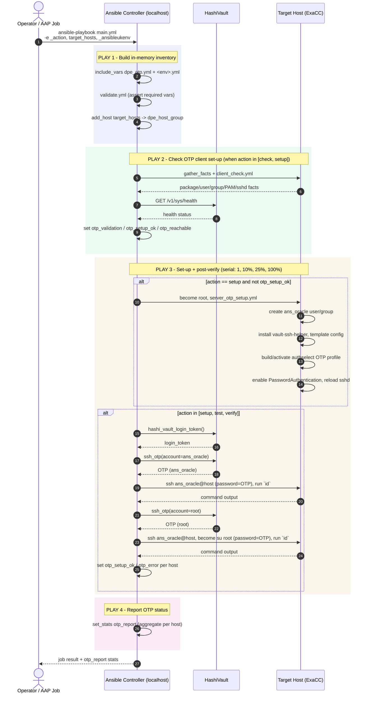

# dpe_oracle_otp

Ansible playbook that sets up and validates **HashiVault SSH One-Time-Password (OTP)** authentication on Oracle DPE ExaCC hosts.

It configures each target host to authenticate SSH logins via a Vault-issued OTP (through `vault-ssh-helper`, PAM, and an `authselect` profile), then proves the setup works by actually logging in with a Vault-generated OTP as both the unprivileged `ans_oracle` account and root (via `su`).

## What it does

The play is split into four sequential Ansible plays:

1. **Build in-memory inventory** (`localhost`)
   Loads `vars/dpe_otp.yml` and the environment-specific `vars/<env>.yml`, validates the required extra-vars (`tasks/validate.yml`), then adds every host in `target_hosts` to an in-memory group (`dpe_host_group`) so the rest of the play can target them without a static inventory file.

2. **Check OTP client set-up status** (target hosts, parallel/linear, `gather_facts: yes`)
   Runs `tasks/client_check.yml` when `_action` is `check` or `setup`. This inspects each host's current state — landing account/group, `vault-ssh-helper` package/binary/config, PAM stack, `sshd_config` — without changing anything, and builds an `otp_validation` fact.

3. **Set-up hosts for OTP and verify post-setup** (target hosts, rolled out in batches: `1`, `10%`, `25%`, `100%`, `max_fail_percentage: 0`)
   - If `_action == setup` and the host isn't already `otp_setup_ok`, runs `tasks/server_otp_setup.yml` (as root, via `become`) to create the `ans_oracle` account/group, install `vault-ssh-helper`, template its config, build/activate a custom `authselect` profile, and enable `PasswordAuthentication` in `sshd_config`/`sshd_config.d`.
   - For `_action` in `setup`, `test`, `verify`, runs `tasks/check_otp_connection.yml` to fetch a Vault login token and two short-lived SSH OTPs (one for `ans_oracle`, one for `root`), then actually SSHes in as each to prove OTP auth works end-to-end. Failures are caught and recorded as `otp_error`; a first-attempt-unreachable host is treated as expected (pre-setup) rather than a hard failure.
   - Records `otp_setup_ok` per host from the connection test result.

4. **Report OTP status** (`localhost`)
   Aggregates an `otp_report` dict (one entry per host) into Ansible stats via `set_stats`, combining `otp_setup_ok`, `otp_reachable`, the full `otp_validation` breakdown, and OS facts.

### Task files

| File | Purpose |
|---|---|
| `tasks/validate.yml` | Asserts required extra-vars are present and valid before anything runs. |
| `tasks/client_check.yml` | Read-only audit of OTP client prerequisites on a target host; produces `otp_validation` / `otp_setup_ok` / `otp_reachable`. |
| `tasks/server_otp_setup.yml` | Idempotent setup: landing account, `vault-ssh-helper` package + config, `authselect` profile, PAM/sshd changes. Requires root. |
| `tasks/check_otp_connection.yml` | Pulls a Vault login token and per-account SSH OTPs, then SSHes in as `ans_oracle` and as `root` (via `su`) to confirm OTP login works. |
| `tasks/get_from_vault.yml` | Fetches a separate `build_credentials` secret (`dp_svc_api_user`/`password`) from Vault. **Not currently called from `main.yml`** — present in the role but unused by this play as it stands. |

> **Note:** `server_otp_setup.yml` references Jinja2 templates (`vault-helper.hcl.j2`, `password-auth.j2`, `system-auth.j2`, `postlogin.j2`) that must exist in a `templates/` directory alongside `main.yml`. No `templates/` directory exists in this checkout — it needs to be added (or supplied by a collection/role search path) before `setup` can run.

## Inputs

### Required extra-vars (validated in `tasks/validate.yml`)

| Variable | Description |
|---|---|
| `_action` | One of `check`, `verify`, `test`, `setup` (see `action_list` in `vars/dpe_otp.yml`). Controls which plays/tasks execute. |
| `target_hosts` | Non-empty list of hostnames to operate on. |
| `_ansibleukenv` | Environment name — `dev`, `uat`, or `prod`. Selects `vars/<env>.yml` and defaults to `dev` if unset when loading vars (but must still be one of the three for validation to pass). |

### Environment variables (read via `lookup('env', ...)`)

| Variable | Used for |
|---|---|
| `_CLIENT__HASHI_URL` | HashiVault base URL (trailing `/v1` stripped automatically). |
| `_CLIENT__HASHI_NAMESPACE` | Vault namespace for the login/secret lookups. |
| `_CLIENT__HASHI_ROLE` | Vault AppRole used for the login token and SSH OTP secrets engine. |

### Vars files

- `vars/dpe_otp.yml` — Vault URL for the client, plus a comment noting two AppRoles are needed since a template can only carry one `_client_` approle.
- `vars/dev.yml` (and equivalent `uat.yml` / `prod.yml`, not yet present) — per-environment settings: `dpe_aap_account` / `dpe_aap_group` (the `ans_oracle` landing account), `vault_helper` (package name, binary path, config dir, Vault SSH secrets-engine namespaces), `dpe_legacy_ssh_user`, `dpe_host_group`, `authselect_otp_profile`, `pam_files`, and `action_list`.

### External dependencies

- Ansible collections: `community.hashi_vault` (`vault_kv2_get`), `community.general` (`json_query` filter).
- A custom collection providing the `_client_.epe.hashi_vault_login_token` and `_client_.epe.ssh_otp` lookup plugins used to mint the Vault login token and per-account SSH OTPs.
- SSH access to targets as `dpe_legacy_ssh_user` (`oraansible` in `dev`), with sudo, for the initial setup play.
- Vault SSH secrets engine configured with the namespaces listed under `vault_helper.namespace`.

## Outputs

- **`otp_report`** — an Ansible stat (visible in job output / AAP artifacts) keyed by hostname, each containing:
  - `otp_setup_ok` — whether setup + post-verify succeeded.
  - `otp_reachable` — whether the client-check play could reach/validate the host.
  - `otp_validation` — the full per-host validation object (user/group state, helper package/binary/config, PAM contents, sshd config flags, Vault reachability, SSH service state).
  - `ansible_distribution`, `ansible_distribution_version` — OS facts for context.
- **Host facts** (available for downstream plays/consumers): `otp_setup_ok`, `otp_reachable`, `otp_validation`, `otp_error`.
- **Live command output** — `check_otp_connection.yml` prints the `id` command output for both the `ans_oracle` and elevated (`root`) OTP logins, giving a human-readable proof of connectivity in the job log.
- **Failure behaviour** — the setup/verify play fails a host outright (`max_fail_percentage: 0`) if OTP login doesn't succeed on a non-`first_attempt` run; a first attempt that's unreachable is treated as expected and its host errors are cleared rather than failing the run.

## Usage

```bash
ansible-playbook main.yml \
  -e "_action=setup" \
  -e "_ansibleukenv=dev" \
  -e '{"target_hosts":["exacc-node01","exacc-node02"]}'
```

Typical `_action` values:
- `check` — read-only audit of client prerequisites only (Play 2).
- `setup` — provision the host, then verify OTP login (Plays 2–3).
- `test` / `verify` — verify OTP login only, without provisioning (Play 3's verify step).

## Sequence diagram


