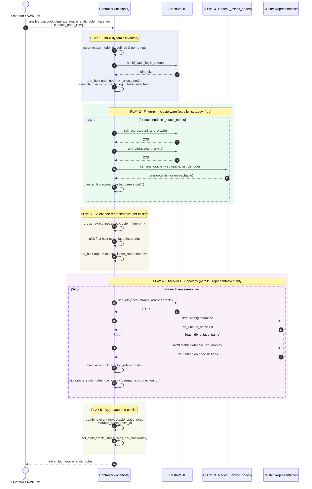

# generate_oracle_static_role_tfvars.yml

Ansible playbook that discovers Oracle RAC database topology across a flat list of ExaCC nodes — which may span **many separate RAC clusters** — and produces a map of Vault static-role definitions (`username` + `connection_url`) ready to feed a downstream Terraform step that provisions Vault DB static roles.

It is deliberately built to avoid running expensive discovery (`srvctl`) on every node: it fingerprints cluster membership first (cheap, parallel, read-only) and then runs the real discovery **once per unique cluster**, on a single representative host.

## What it does

The input is a flat list of node FQDNs (`exacc_node_list`) with no indication of which nodes belong to which RAC cluster. The playbook figures that out itself, in five plays:

1. **Build dynamic inventory** (`localhost`)
   Validates `exacc_node_list` is a non-empty list, obtains a Vault login token (`_client_.epe.hashi_vault_login_token`), and adds every node into an in-memory group `_exacc_nodes` with `ansible_user: ans_oracle` and the shared `login_token` attached to each host.

2. **Fingerprint clusterware membership** (`_exacc_nodes`, `strategy: free`, parallel, `ignore_unreachable: true`)
   Runs `olsnodes` on **every** node (cheap and safe to run everywhere) as `ans_oracle` → `su oracle`, authenticating with per-host, per-account Vault SSH OTPs. The sorted, comma-joined list of peer nodes becomes that host's `cluster_fingerprint` — nodes in the same RAC cluster produce an identical fingerprint. Unreachable/failed nodes are simply skipped (no fingerprint set), not fatal to the run.

3. **Select one representative per cluster** (`localhost`)
   Walks all fingerprinted nodes and picks the *first* host seen for each distinct `cluster_fingerprint`, registering those into a new group `exacc_cluster_representatives`. This is what keeps the next play correct-and-cheap even in parallel: each representative covers a distinct cluster, so there's no `run_once`/ordering assumption needed.

4. **Discover DB topology per cluster** (`exacc_cluster_representatives` only, `strategy: free`, parallel)
   For each representative: runs `srvctl config database` to list `db_unique_name`s, then `srvctl status database -db <name>` for each, and regex-parses `is running on node (\S+)` out of the output to build a `db_unique_name → [hosts]` topology map. Hostnames are turned into FQDNs (`+ '.' + dns_domain`) and combined with each configured role username into a static-role map:
   `role_key = "{username}_{db_unique_name}_{role_suffix}"` (all upper-case) → `{username, connection_url: "host1.fqdn,host2.fqdn"}`.

5. **Aggregate and publish** (`localhost`)
   Merges every representative's per-cluster `oracle_static_roles` dict into one `oracle_static_roles_all`, then publishes it as a single AWX/Controller job artifact via `set_stats` (`oracle_static_roles`, `per_host: false`).

## Inputs

### Required extra-vars

| Variable | Description |
|---|---|
| `exacc_node_list` | YAML list of ExaCC node FQDNs to scan, e.g. `-e '{"exacc_node_list": ["node1.example.com","node2.example.com"]}'`. Can span any number of distinct RAC clusters — need not be pre-grouped. |

### Required environment variables (same as `sys_password_rotation` / `dpe_oracle_otp`)

| Variable | Used for |
|---|---|
| `_CLIENT__HASHI_URL` | Vault address. |
| `_CLIENT__HASHI_NAMESPACE` | Vault namespace. |
| `_CLIENT__HASHI_ROLE` | Vault role used for OTP SSH auth (`ssh_otp` lookups). |

### Optional extra-vars

| Variable | Default | Description |
|---|---|---|
| `grid_home` | `/u01/app/19.0.0.0/grid` | Oracle Grid Infrastructure home; its `bin/` is prepended to `PATH` for `olsnodes`/`srvctl`. |
| `dns_domain` | `systems.uk._client_` | Domain suffix appended to bare hostnames returned by `srvctl status database` to build `connection_url`. |
| `oracle_role_usernames` | `["sys"]` | List of DB usernames to generate a static role for, per database. |
| `role_suffix` | `"EXACC"` | Suffix appended to every generated role key. |
| `debug_output` | `false` | When `true`, dumps each cluster's `oracle_static_roles` map to the job log during Play 4. |

## Outputs

- **`oracle_static_roles`** — published via `set_stats` (`per_host: false`, `aggregate: false`) as a single job artifact, automatically captured by AWX/Ansible Controller. Shape:

  ```json
  {
    "SYS_ORCLDB1_EXACC": {
      "username": "SYS",
      "connection_url": "exacc-node01.systems.uk._client_,exacc-node02.systems.uk._client_"
    },
    "SYS_ORCLDB2_EXACC": {
      "username": "SYS",
      "connection_url": "exacc-node03.systems.uk._client_,exacc-node04.systems.uk._client_"
    }
  }
  ```

  One entry per `(database, role username)` pair, across **all** discovered clusters — this is the input a downstream pipeline step would consume to render Terraform `tfvars` for Vault DB static roles.
- **Debug logging** — inventory/discovery summaries at the end of Plays 1, 3, 4 (if `debug_output`), and 5, reporting node counts, cluster counts, and excluded/unreachable node counts.
- **No changes on target hosts** — this playbook is entirely read-only discovery (`olsnodes`, `srvctl config`, `srvctl status`); it makes no `changed` modifications to any node.

## Usage

```bash
ansible-playbook generate_oracle_static_role_tfvars.yml \
  -e '{"exacc_node_list": ["exacc-node01.example.com","exacc-node02.example.com","exacc-node03.example.com"]}'
```

With optional overrides:

```bash
ansible-playbook generate_oracle_static_role_tfvars.yml \
  -e '{"exacc_node_list": ["exacc-node01.example.com"], "dns_domain": "systems.uk._client_", "oracle_role_usernames": ["sys","system"], "debug_output": true}'
```

The node list does not need to be de-duplicated by cluster beforehand — pass every node you have credentials for and let Plays 2–3 work out which ones are redundant.

## Requirements

- A custom collection providing the `_client_.epe.hashi_vault_login_token` and `_client_.epe.ssh_otp` lookup plugins (same as used by `dpe_oracle_otp`).
- SSH access to every node in `exacc_node_list` as `ans_oracle`, with `su` access to `oracle`, both authenticated via Vault-issued OTPs — i.e. hosts must already have OTP SSH set up (see the `dpe_oracle_otp` playbook).
- `olsnodes` and `srvctl` available on `$PATH` once `grid_home/bin` is prepended (standard for a Grid Infrastructure install).

## Design notes

- **Parallelism is safe by construction.** Play 2 fingerprints every node in parallel (`strategy: free`) with no shared state between hosts. Play 4 runs discovery only on cluster representatives, and since each representative is guaranteed to belong to a distinct cluster (Play 3's dedup), running them in parallel can't produce cross-cluster contention or duplicate work.
- **Unreachable nodes degrade gracefully.** `ignore_unreachable: true` plus `cluster_fingerprint` only being set `when: olsnodes_result is succeeded` means a node that's down or mid-provisioning simply gets excluded from representative selection rather than failing the whole run.
- **Representative selection is "first seen wins".** If a cluster's first-listed node in `exacc_node_list` happens to be unreachable, whichever *next* node with the same fingerprint succeeds becomes the representative — there's no explicit "best node" selection logic beyond fingerprint order.

## Sequence diagram


