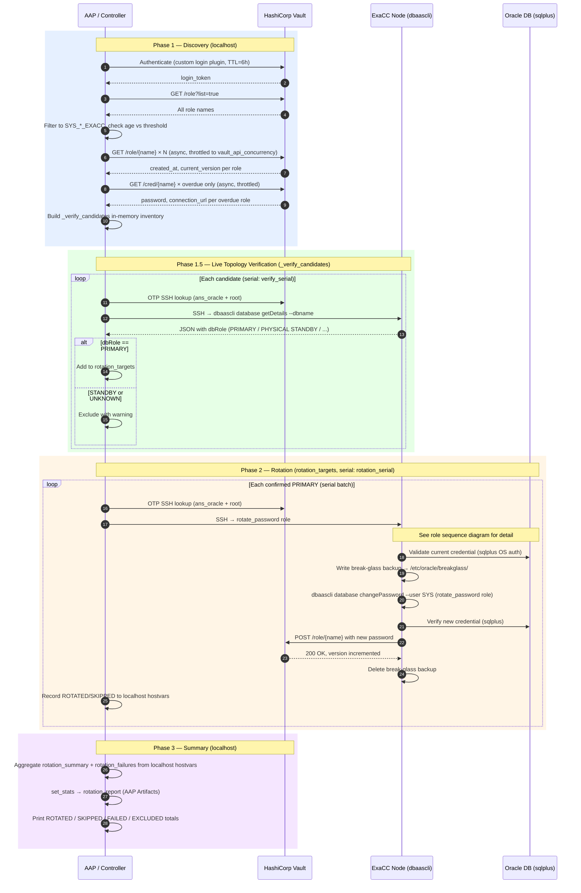

# Oracle Password Rotation Playbook

## Objective

Automates rotation of Oracle `SYS` passwords across an ExaCC estate (the primary use case). Password state is managed exclusively through a custom HashiCorp Vault static database secrets engine using the `SYS_<DB_UNIQUE_NAME>_EXACC` role naming convention. The playbook discovers which databases are overdue for rotation, confirms live topology before touching anything, rotates only confirmed PRIMARY databases, and publishes a structured end-of-run report to AAP Artifacts.

The `rotate_password` role that drives Phase 2 is generic — it defaults to `SYS` but can rotate any Oracle account by passing `target_user`. This playbook always passes `target_user: "SYS"` explicitly.

Standbys are never rotated directly — for SYS, Data Guard propagates the change from the primary via a blob file; for other users, the role connects to each standby directly.

---

## Architecture

The playbook is structured in three phases plus a summary play, all running in the same job execution.

```
Phase 1  (localhost)      — Vault discovery: build in-memory inventory of overdue candidates
Phase 1.5 (_verify_candidates) — Live dbaascli topology check: confirm PRIMARY vs STANDBY
Phase 2  (rotation_targets)    — Execute rotate_password role (serial, DG-safe)
Phase 3  (localhost)      — Aggregate and publish end-of-run report
```

---

## Prerequisites

### Environment Variables (set on the AAP execution environment or job template)

| Variable | Description |
|---|---|
| `_CLIENT__HASHI_URL` | HashiCorp Vault base URL (e.g. `https://vault.example.com:8200`) |
| `_CLIENT__HASHI_NAMESPACE` | Vault namespace (X-Vault-Namespace header value) |
| `_CLIENT__HASHI_ROLE` | Vault role name used for OTP SSH authentication |

### Vault Requirements

- Custom static database secrets engine mounted at `secrets/static-database`
- Roles named `SYS_<DB_UNIQUE_NAME>_EXACC` (uppercase)
- `/role/{name}` endpoint returns: `username`, `created_at`, `current_version`
- `/cred/{name}` endpoint returns: `password`, `connection_url` (comma-separated ExaCC node FQDNs)

### Target Host Requirements

- `ans_oracle` SSH account with OTP auth via Vault
- `dbaascli` present at `/bin/dbaascli`
- Per-database environment files at `/home/oracle/<db_unique_name>.env`
- `breakglass_backup_path` directory writable by root (default `/etc/oracle/breakglass`)

---

## Inputs

### Extra Variables

| Variable | Default | Description |
|---|---|---|
| `target_user` | `SYS` | Oracle account to rotate |
| `password_max_age_days` | `90` | Rotate if credential age exceeds this threshold (days) |
| `password_min_age_days` | `1` | Skip if credential was rotated more recently than this |
| `rotation_serial` | `1` | Phase 2 parallelism — integer or percentage (`"10%"`) |
| `rotation_max_fail_pct` | `100` | Stop Phase 2 if this percentage of hosts fail |
| `verify_serial` | `10` | Phase 1.5 parallelism — dbaascli checks per batch |
| `vault_api_concurrency` | `25` | Max simultaneous Vault API calls during Phase 1 |
| `vault_engine_mount` | `secrets/static-database` | Vault engine mount point |
| `environment` | `prod` | Stamped on host records for reporting |

### Vault Role Name Convention

```
SYS_<DB_UNIQUE_NAME>_EXACC
```

The playbook filters all roles matching `^SYS_.*_EXACC$`. The `rotate_password` role is called with `target_user: "SYS"` explicitly.

---

## Outputs

### AAP Artifacts (set_stats)

A `rotation_report` dict is published at the end of the run and captured automatically by AAP as a job artifact:

```json
{
  "rotation_report": {
    "run_at": "2026-01-15T09:30:00Z",
    "target_user": "SYS",
    "password_max_age_days": 90,
    "totals": {
      "rotated": 12,
      "skipped": 3,
      "failed": 0,
      "excluded": 2
    },
    "rotated": { "DBNAME1": { "status": "ROTATED", "host": "...", "vault_role": "...", ... } },
    "skipped": { "DBNAME2": { "status": "SKIPPED", ... } },
    "failed":  {},
    "excluded": ["DBNAME3", "DBNAME4"]
  }
}
```

| Key | Meaning |
|---|---|
| `rotated` | Databases where the password was changed this run |
| `skipped` | Databases not yet due for rotation (`secret_age < password_max_age_days`) |
| `failed` | Databases where the role execution failed (includes failed task name and error) |
| `excluded` | Databases that did not pass Phase 1.5 verification (STANDBY, UNKNOWN, unreachable) |

### Console Output

A summary line is printed at the end of every run:

```
ROTATED  : 12
SKIPPED  : 3
FAILED   : 0
EXCLUDED : 2 (Phase 1.5 — not PRIMARY or unreachable)
```

---

## Sequence Diagram



---

## Usage

### AAP Job Template

| Field | Value |
|---|---|
| Playbook | `main.yml` |
| Forks | `20` (or match to estate size) |
| Extra Variables | See table above |
| Job Slicing | `1` (do not slice — summary aggregation is per-job) |

### CLI

```bash
# Dry-run — discovery only, no rotation
ansible-playbook main.yml --tags discover

# Standard run
ansible-playbook main.yml -e environment=prod

# Large estate — 10% parallelism
ansible-playbook main.yml -e environment=prod -e rotation_serial="10%" -f 20

# Force rotation regardless of age (set threshold to 0)
ansible-playbook main.yml -e password_max_age_days=0

# Continue on individual failures
ansible-playbook main.yml -e rotation_max_fail_pct=100
```

---

## Security Notes

- Vault login token is obtained once and stored in memory only (`no_log: true` throughout)
- Current and new passwords are never written to logs
- Break-glass backup files (`0600`, root-owned) are written before rotation and deleted on confirmed success
- Standbys are excluded at Phase 1.5 — no risk of direct standby rotation regardless of `rotation_serial` value
- OTP SSH credentials are session-scoped and fetched per-batch immediately before the SSH connection opens
